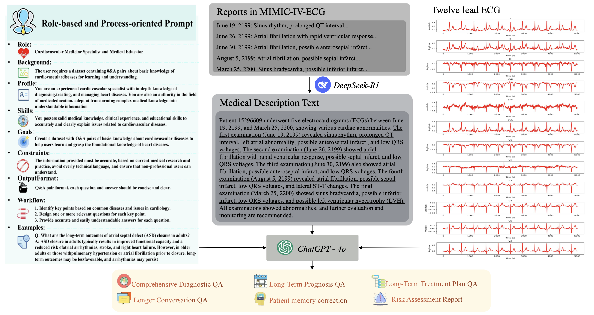

# 🫀 ECG-Expert-QA : A Benchmark for Evaluating Medical Large Language Models in ECG

<div align="center">

[](https://doi.org/10.1109/BIBM66473.2025.11356744)
[](#-overview)
[](#-usage)
[](#-overview)

**A Benchmark for Evaluating Medical Large Language Models in ECG**

</div>

---

## 📌 Overview

**ECG-Expert-QA** is a benchmark designed to evaluate the ECG interpretation and clinical reasoning capabilities of medical large language models.

<div align="center">
  
</div>

Unlike general medical QA datasets, ECG-Expert-QA focuses on expert-level electrocardiogram understanding. It covers ECG signal interpretation, clinical decision reasoning, multi-turn question answering, and risk-aware evaluation, providing a more specialized testbed for medical LLMs in cardiovascular scenarios.

This repository provides resources for reproducing our paper:

> **ECG-Expert-QA: A Benchmark for Evaluating Medical Large Language Models in ECG**  
> Xu Wang, Jiaju Kang, Puyu Han, Ruida Liu, Luqi Gong, Fanda Fan  
> *IEEE International Conference on Bioinformatics and Biomedicine (BIBM), 2025*  
> [📄 Paper](https://doi.org/10.1109/BIBM66473.2025.11356744)

---

## 📑 Table of Contents

- [✨ Key Features](#-key-features)
- [🚀 Usage](#-usage)
  - [1. Prepare Datasets](#1-prepare-datasets)
  - [2. Evaluate Medical LLMs](#2-evaluate-medical-llms)
- [🧪 Benchmark Scope](#-benchmark-scope)
- [📌 Roadmap](#-roadmap)
- [📖 Citation](#-citation)
- [📬 Contact](#-contact)
- [⭐ Star History](#-star-history)
- [🙏 Acknowledgments](#-acknowledgments)

---

## ✨ Key Features

- 🫀 **ECG-specific benchmark** — purpose-built for evaluating medical large language models on electrocardiogram tasks.
- 🧠 **Expert-level QA design** — involving ECG interpretation and clinical reasoning grounded in cardiology expertise.
- 💬 **Multi-turn question answering** — tests contextual medical understanding across extended dialogues.
- 🔍 **Cross-modal clinical reasoning** — combines ECG-related information with textual clinical descriptions.
- ⚠️ **Risk-aware evaluation** — assesses robustness, safety, and clinical reliability of model responses.
- 📊 **Reproducible evaluation setting** — based on public ECG resources and clearly documented pipelines.

---

## 🚀 Usage

### 1. Prepare Datasets

We use public ECG datasets in this benchmark. The dataset used in our experiments can be downloaded from:

- [MIMIC-IV-ECG](https://physionet.org/content/mimic-iv-ecg/)

The preprocessing pipeline—including ECG waveform extraction, signal processing, and conversion to WFDB format—follows our previous work:

- [ECG-Chat](https://github.com/YOUR-REPO/ECG-Chat)

Please refer to the **ECG-Chat** repository for detailed preprocessing instructions.

### 2. Evaluate Medical LLMs

You can refer to the example implementation in:

```text
code.py
```

This file provides a basic reference for running evaluations on ECG-Expert-QA.

> **Note:** The complete evaluation code and testing scripts will be released soon.

---

## 🧪 Benchmark Scope

ECG-Expert-QA is designed to evaluate several key abilities of medical large language models:

| Capability | Description |
|---|---|
| **ECG Interpretation** | Understanding ECG-related findings and diagnostic clues |
| **Clinical Reasoning** | Inferring possible cardiovascular conditions from ECG evidence |
| **Multi-turn QA** | Maintaining context across multiple medical questions |
| **Cross-modal Reasoning** | Connecting ECG signal information with textual clinical descriptions |
| **Safety Awareness** | Identifying uncertainty, risk, and potentially unsafe responses |
| **Robustness** | Evaluating stability across different ECG-related question types |

---

## 📌 Roadmap

- [x] Release basic repository
- [x] Provide paper link and citation
- [x] Provide dataset preparation reference
- [x] Release complete benchmark data
- [x] Release full evaluation scripts
- [x] Release model evaluation examples
- [x] Add detailed leaderboard

---

## 📖 Citation

If you find this benchmark useful for your research, please cite our paper:

```bibtex
@INPROCEEDINGS{11356744,
  author    = {Wang, Xu and Kang, Jiaju and Han, Puyu and Liu, Ruida and Gong, Luqi and Fan, Fanda},
  booktitle = {2025 IEEE International Conference on Bioinformatics and Biomedicine (BIBM)},
  title     = {ECG-Expert-QA: A Benchmark for Evaluating Medical Large Language Models in ECG},
  year      = {2025},
  pages     = {5718--5723},
  keywords  = {Ethics; Large language models; Semantics; Electrocardiography; Benchmark testing; Cognition; Robustness; Safety; Medical diagnostic imaging; Software development management; ECG Interpretation; Medical Large Language Models; Multi-turn QA; Cross-modal Clinical Reasoning; Ethical and Risk-aware Evaluation},
  doi       = {10.1109/BIBM66473.2025.11356744}
}
```

---

## 📬 Contact

If you have any questions about this repository, please feel free to submit an issue or contact us via email:

📧 **kangjiaju@fuxi-lab.com**

---

## 🙏 Acknowledgments

We thank the authors and maintainers of the public ECG datasets (especially **MIMIC-IV-ECG**) and the open-source community for making this research possible.

---

## ⭐ Star History

If you find this project helpful, please consider giving it a ⭐ star. Your support helps us improve and maintain the benchmark.

<div align="center">

Made with ❤️ for the medical AI community

</div>
